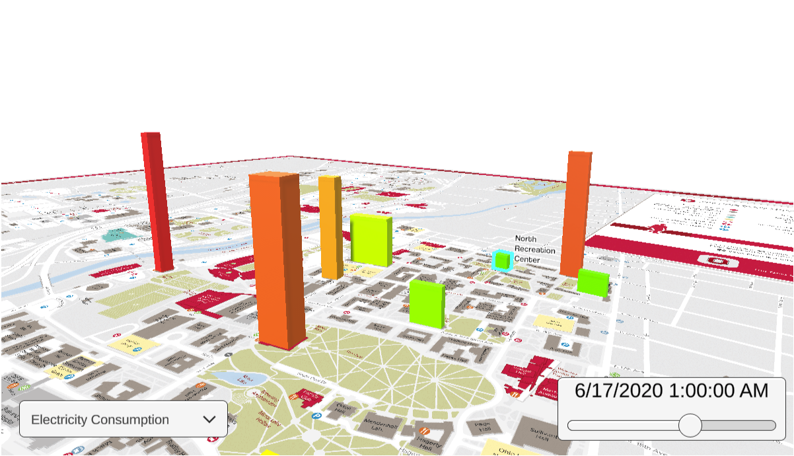

# EnergyVisualizationTool

  

## About

This project is an energy visualization tool made in 12 hours for the [HackOHI/O X Hackathon](https://hack.osu.edu/2022/). It was embedded into an energy dashboard which our team made to display energy consumption data in buildings across campus.

## WebGL Build

Click [here](https://lunkums.github.io/EnergyVisualizationTool/) to view the tool in your browser!
